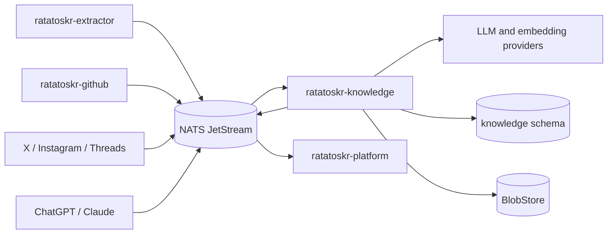
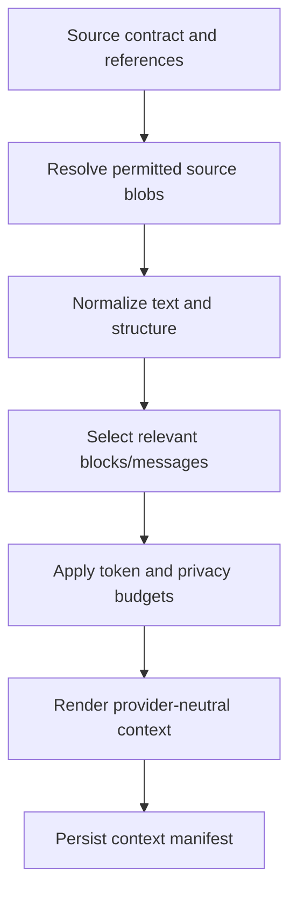
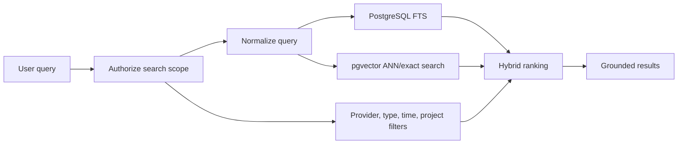

# Ratatoskr Knowledge Architecture

> Status: target architecture. The first article-analysis slice and one bounded `OpenRouter`
> adapter are implemented; later analysis families, indexing, retrieval, and additional provider
> adapters remain targets.

## 1. Purpose

`ratatoskr-knowledge` converts stable source material into versioned, structured, searchable knowledge.

It owns:

- article and document analysis;
- repository analysis;
- social-source analysis;
- ChatGPT and Claude archive indexing;
- entities, topics, relations, and summaries;
- embeddings and hybrid retrieval;
- durable model-run state;
- citations and provenance links;
- analysis evaluation and reprocessing.

It does not fetch arbitrary web pages, run Chromium, synchronize provider accounts, execute Git, or own raw provider archives.

## 2. Architectural position



Source services remain authoritative for source records. Knowledge stores analysis versions and search projections that reference those records.

## 3. Repository structure

```text
ratatoskr-knowledge/
├── crates/
│   ├── knowledge-domain/
│   ├── analysis-engine/
│   ├── analysis-contracts/
│   ├── context-builder/
│   ├── prompt-registry/
│   ├── provider-adapters/
│   ├── structured-output/
│   ├── embeddings/
│   ├── search/
│   ├── citations/
│   ├── persistence/
│   ├── eventing/
│   ├── telemetry/
│   └── test-support/
├── services/
│   └── knowledge/
├── prompts/
├── evaluations/
├── schema.sql
├── fixtures/
├── tests/
└── docs/
```

Prompt content and evaluation fixtures are versioned source artifacts, not inline strings scattered through handlers.

## 4. Bounded context and data ownership

Knowledge owns:

```text
knowledge.analysis_requests
knowledge.analysis_runs
knowledge.analysis_results
knowledge.analysis_revisions
knowledge.prompt_versions
knowledge.contract_versions
knowledge.source_references
knowledge.entities
knowledge.entity_mentions
knowledge.topics
knowledge.relations
knowledge.embeddings
knowledge.search_documents
knowledge.index_jobs
knowledge.outbox
knowledge.inbox
```

It does not own:

- raw HTML/PDF authority;
- provider account state or tokens;
- GitHub star state;
- Git mirrors or backups;
- ChatGPT/Claude raw export authority;
- public user identity or sessions.

Cross-schema reads and writes are not runtime APIs. Source data arrives through contracts, events, and scoped internal queries where explicitly designed.

## 5. Analysis families

### 5.1. Document analysis

Inputs:

- canonical Document IR;
- source metadata and provenance;
- optional user note or collection context;
- optional related documents.

Outputs may include:

- concise and extended summary;
- key claims;
- entities and topics;
- action items;
- chronology;
- technical concepts;
- open questions;
- source-grounded citations.

### 5.2. Repository analysis

Inputs:

- repository metadata;
- README/documentation snapshots;
- languages and topics;
- optional release or watch context.

Outputs may include:

- purpose and category;
- architecture and stack;
- maturity signals;
- notable capabilities;
- risks and maintenance status;
- relevance to user-defined interests.

Repository analysis never mutates GitHub state and never invokes Git backup.

### 5.3. Social-source analysis

Inputs preserve acquisition and authority semantics. Analysis may cover:

- what the post asserts;
- author and publication context;
- quoted/replied/reposted relations;
- external links;
- media descriptions when available;
- confidence and missing context.

If an external article is available, the system may produce a composite analysis with separate citations for the social post and article. It must not merge them into one unattributed narrative.

### 5.4. AI archive analysis

ChatGPT and Claude content may be indexed at:

- message;
- branch;
- conversation;
- project;
- artifact or Canvas;
- project-knowledge source.

Analysis supports retrieval such as:

- where a topic was discussed;
- decisions and rationale across conversations;
- unresolved tasks;
- related repositories, articles, or social sources;
- duplicate or evolved ideas.

Private conversation content is never sent to a remote model unless the configured privacy policy explicitly permits it.

## 6. Durable analysis state machine

Knowledge uses an explicit state machine rather than a hidden graph framework.

```text
queued
-> context_prepared
-> provider_requested
-> response_received
-> schema_validated
-> repairing, when allowed
-> persisted
-> indexing
-> completed
```

Terminal alternatives:

```text
failed_transient
failed_permanent
cancelled
superseded
```

### 6.1. Run identity

An analysis run is uniquely characterized by:

- source ID and immutable source content hash;
- analysis family;
- analysis contract name and version;
- prompt version;
- context-builder version;
- provider and model;
- model parameters;
- policy profile;
- optional locale.

The same tuple is idempotent unless an explicit rerun nonce is supplied.

### 6.2. Stored evidence

Each run records:

- input references and hashes;
- assembled context blob or reproducible context manifest;
- provider request metadata;
- raw response blob;
- parsed structured output;
- validation errors;
- repair attempt and response;
- token and cost usage;
- latency and retries;
- final status and warnings.

Raw prompts and responses containing private content are stored only under the configured retention and encryption policy.

## 7. Context construction

Context building is deterministic and versioned.



Context rules:

- use canonical Document IR or provider archive records, not scraped UI text;
- retain source identifiers and block/message references;
- truncate by semantic sections rather than arbitrary bytes;
- preserve code and tables when relevant;
- mark omitted sections;
- never include credentials or hidden provider metadata;
- separate user instructions from untrusted source text.

## 8. Prompt architecture

Prompts are registered, versioned artifacts.

```text
prompts/
├── article-summary/
│   ├── v1/system.md
│   ├── v1/user-template.md
│   └── v1/schema.json
├── repository-analysis/
├── social-analysis/
└── conversation-indexing/
```

A prompt version includes:

- goal and non-goals;
- system instructions;
- input rendering template;
- output contract;
- supported locales;
- provider-specific adaptation rules;
- evaluation suite references;
- migration notes.

Changing text that can alter output semantics creates a new prompt version.

## 9. Provider abstraction

```rust
#[async_trait]
pub trait LlmProvider {
    async fn generate_json(
        &self,
        request: GenerationRequest,
    ) -> Result<ProviderResponse, ProviderError>;
}

#[async_trait]
pub trait EmbeddingProvider {
    async fn embed(
        &self,
        request: EmbeddingRequest,
    ) -> Result<EmbeddingResponse, ProviderError>;
}
```

Provider adapters own:

- authentication and endpoint configuration;
- request/response translation;
- retry classification;
- rate-limit metadata;
- model capability discovery;
- token usage normalization.

Domain analysis code does not contain provider-specific JSON or SDK types.

### 9.1. Provider credentials

Model-provider credentials belong only to Knowledge or a dedicated secret backend configured for Knowledge. They do not flow to Extractor, Platform clients, or source services.

### 9.2. Local models

Local inference adapters follow the same contracts. Privacy policy may require local-only processing for selected source classes.

## 10. Structured output

### 10.1. Validation

Provider output is treated as untrusted data.

Processing:

1. Parse JSON without executing embedded content.
2. Validate against the exact contract version.
3. Deserialize into typed Rust structures.
4. Validate semantic invariants and citation references.
5. Perform at most the configured bounded repair attempts.
6. Persist raw and validated representations separately.

### 10.2. Repair

Repair is permitted only when:

- output is syntactically or structurally close to valid;
- the contract permits repair;
- budget remains;
- no source content or unsupported facts need to be invented.

A repaired result records the original response and repair provenance.

## 11. Grounding and citation model

Every claim that requires source support carries references to source evidence.

A citation references:

- source service and source ID;
- immutable content hash or snapshot ID;
- block, page, message, or provider-object location;
- optional quoted span hash;
- analysis run ID.

The validator checks that references resolve within the supplied context. Models cannot cite arbitrary URLs that were not part of the input without marking them as unverified model output.

## 12. Prompt injection and untrusted content

Documents, posts, repository files, and archived chats are untrusted input. They may contain instructions aimed at the model or system.

Defenses:

- clear separation of system instructions and source data;
- source content wrapped in typed, labelled sections;
- no tool execution based solely on source text;
- allowlisted tool capabilities per analysis family;
- output schema validation;
- no provider credentials or internal policies in context;
- citation-based grounding;
- evaluation fixtures containing adversarial instructions.

Knowledge analysis never treats source text as authorization to perform external writes.

## 13. Embedding architecture

### 13.1. Embedding units

Embedding units are versioned and source-aware:

- document sections;
- social posts or threads;
- repository summaries/README sections;
- conversation branches or semantic message windows;
- project knowledge chunks.

Each vector stores:

- source reference;
- source content hash;
- chunker version;
- embedding model and dimension;
- privacy class;
- generated timestamp;
- searchable metadata.

### 13.2. Reindexing

A model, chunker, or source-hash change creates a new embedding version. Reindexing is resumable and does not delete the previous active index until the new version is complete and validated.

## 14. Search architecture

Default storage:

- PostgreSQL full-text search;
- `pgvector`;
- hybrid rank fusion;
- structured metadata filters.



Search authorization is applied before result exposure. The index does not become an authorization bypass.

### 14.1. Search document

A search projection contains:

- source reference and owner;
- title and normalized text;
- content type and provider;
- timestamps;
- project/collection/repository associations;
- source and analysis hashes;
- FTS vector;
- embedding version references;
- visibility and retention state.

### 14.2. Ranking

Ranking may combine:

- text rank;
- vector similarity;
- exact title/entity match;
- recency;
- source quality;
- user-selected filters;
- duplicate suppression.

Rank formulas are versioned and evaluated. They do not use hidden provider relevance signals without provenance.

## 15. Entities, topics, and relations

Knowledge may maintain normalized entities and relations, but source truth remains separate.

Examples:

```text
conversation -> discusses -> repository
social post -> links_to -> article
article -> mentions -> organization
project -> contains -> conversation
repository -> uses -> technology
```

Entity merges are reversible and preserve aliases and source mentions. An LLM suggestion does not become a permanent merge without deterministic rules or review policy.

## 16. Commands and events

### 16.1. Commands consumed

```text
knowledge.analysis.requested.v1
knowledge.reindex.requested.v1
knowledge.reconcile.requested.v1
knowledge.search_projection.delete_requested.v1
knowledge.repository_analysis.requested.v1
```

### 16.2. Source events consumed

```text
content.document.extracted.v1
github.repository.observed.v1
social.source.captured.v1
social.source.updated.v1
social.source.removed.v1
chatgpt.conversation.upserted.v1
chatgpt.project.upserted.v1
claude.conversation.upserted.v1
claude.project.upserted.v1
```

The social-source facts follow the published `social-source-contracts` capability, and the producer/analyser boundary behaviour for them — fact-as-request semantics, `(social_source_id, content_digest)` result linkage, and removal propagation — is owned by the `ratatoskr-workspace` store spec `social-analysis-intake`, which is cited here rather than restated. The social analysis family itself lands through separate changesets (implementation plan item 9).

### 16.3. Events emitted

```text
knowledge.analysis.completed.v1
knowledge.analysis.failed.v1
knowledge.search_document.indexed.v1
knowledge.search_document.removed.v1
knowledge.repository_analysis.completed.v1
knowledge.repository_analysis.failed.v1
```

Events contain references and bounded results, not full private source content.

## 17. Persistence and consistency

Knowledge uses its own PostgreSQL schema. During development, one editable and idempotent
`schema.sql` defines it; there are no database migrations or migration tooling.

Transactions group:

- state transition;
- result or error metadata;
- index-job creation;
- outbox event.

Remote model calls never occur inside database transactions.

At-least-once delivery is handled with inbox deduplication and idempotent run identity. Repository-analysis request delivery uses the workspace `repository-analysis-intake` spec: its immutable digest is deduplicated in Knowledge-owned state, and a terminal result is linked only to the matching pending revision. Replaying a source event does not create duplicate active analyses or embeddings.

## 18. Privacy architecture

Every source has a privacy class and processing policy.

Possible policies:

```text
local_only
remote_allowed_redacted
remote_allowed_full
index_metadata_only
excluded
```

Policy controls:

- provider selection;
- context redaction;
- raw prompt/response retention;
- embedding provider;
- search indexing;
- telemetry content exclusion.

Private chats, attachments, and project knowledge are excluded from logs. Metrics use counts, sizes, model IDs, and hashes rather than content.

## 19. Cost and rate-limit architecture

A run has explicit budgets:

- maximum input/output tokens;
- maximum provider attempts;
- maximum repair attempts;
- maximum monetary estimate;
- deadline;
- concurrency class.

Budgets may be configured per user, source family, analysis family, and model. Provider rate-limit state and circuit breakers prevent retry storms.

A cache hit is valid only when all run-identity inputs match.

## 20. Failure model

Transient:

- provider timeout or retryable status;
- rate-limit exhaustion;
- temporary BlobStore/DB/event-bus failure;
- local model capacity exhaustion.

Permanent:

- unsupported contract version;
- missing or unauthorized source;
- invalid source references;
- output repeatedly fails schema/semantic validation;
- policy forbids all available providers.

A failed analysis does not corrupt or remove a previous successful version. The active projection changes only after a new version completes.

## 21. Observability

Required telemetry:

```text
analysis_requests_total
analysis_duration_seconds
analysis_failures_total
provider_requests_total
provider_rate_limit_remaining
provider_tokens_total
provider_cost_estimate
structured_output_validation_failures
repair_attempts_total
embedding_jobs_total
embedding_queue_lag
search_latency_seconds
search_result_count
reindex_progress
citation_validation_failures
```

Traces follow correlation and causation IDs from source events through analysis and indexing. Logs never include full prompts, responses, private messages, or credentials by default.

## 22. Evaluation architecture

Evaluations are first-class and versioned.

```text
evaluations/
├── article-summary/
├── repository-analysis/
├── social-analysis/
├── archive-retrieval/
└── adversarial/
```

Evaluation dimensions:

- schema validity;
- factual grounding;
- citation correctness;
- completeness;
- unsupported claims;
- privacy-policy compliance;
- latency and cost;
- search precision/recall;
- multilingual quality;
- prompt-injection resistance.

Provider or prompt changes cannot become default solely because examples look subjectively better; they require agreed evaluation thresholds.

## 23. Testing architecture

### Unit

- state transitions;
- run identity and cache keys;
- context selection and budgeting;
- schema and semantic validators;
- citation resolution;
- ranking and filters;
- policy decisions;
- cost accounting.

### Integration

- current-schema application and PostgreSQL state operations;
- outbox/inbox replay;
- fake LLM and embedding providers;
- BlobStore context/response storage;
- reindex cutover;
- authorization-filtered search.

### Contract

- source events and result events;
- Document IR compatibility;
- social and AI archive contracts;
- generated public search API models.

### Workspace end-to-end

- extract article, analyze, index, and search;
- analyze a GitHub repository without invoking Vault;
- index X and Instagram sources with correct authority metadata;
- import ChatGPT/Claude archives and search project conversations;
- replay events without duplicate results;
- switch embedding version without search downtime.

## 24. Deployment architecture

The current deployment is one process with an admin plane and optional channel-recap worker. It
requires PostgreSQL 17 with pgvector and a writable owned blob directory. The default profile does
not require NATS, model credentials, or Qdrant; enabling recap additionally requires an exact
pre-provisioned JetStream durable and the authenticated loopback digest-source readiness endpoint.
PostgreSQL FTS is the offline retrieval path; configured embeddings add hybrid ranking.

The admin listener is loopback-only. `check-config` validates strict environment settings without
binding. Readiness becomes successful after storage and the current schema are ready and, when recap
is enabled, after both recap dependencies are verified. `SIGINT` and `SIGTERM` start drain; the
process joins the recap supervisor and server shutdown within its configured bound.

An optional dedicated result-reader secret installs
`GET /internal/channel-digest-results/{analysis_id}` on this same loopback listener. It does not
enable the worker or widen readiness: the route is a bounded authenticated projection of an already
completed Knowledge-owned recap. Single-host deployment injects the independent value only into
Knowledge and channel-digest, rotates Knowledge before its consumer, and rolls back the consumer
before disabling or reverting the producer route.

The recap worker may use the existing controlled `OpenRouter` composition, while scripted mode is
the credential-free composed-test path. The loopback `/internal/search` and user-content adapters expose tenant-scoped
query and read-state behavior to Platform; they are not public routes. Their cross-repository
contract is `library-search-read-state` in the workspace OpenSpec store. Additional analysis
transport adapters remain future deployment changes.
Split processes only after a measured scaling or security need exists.

## 25. Migration architecture

Migration from legacy summaries and Qdrant follows:

1. Define versioned analysis contracts.
2. Import existing structured summary JSON with `LegacyImport` provenance.
3. Preserve original payloads and validation warnings.
4. Build PostgreSQL FTS and pgvector projections in parallel.
5. Compare retrieval quality and record counts.
6. Switch reads after reconciliation.
7. Retain rollback until the old vector store is no longer authoritative.
8. Reanalyze only when source hashes and policy justify it.

Exact text equality is not the acceptance criterion for nondeterministic model output. Schema validity, grounding, quality, cost, and user usefulness are.

## 26. Architectural invariants

1. Knowledge interprets stable source material; it does not acquire it.
2. Every analysis is tied to immutable source, prompt, contract, context, and model versions.
3. Model output is untrusted until validated.
4. Repair is bounded and preserves original evidence.
5. Citations resolve to supplied source evidence.
6. Source text never authorizes tools or external writes.
7. Search authorization is enforced before result exposure.
8. Reindexing is versioned and resumable.
9. Previous successful analyses remain available when a new run fails.
10. Provider credentials stay within Knowledge secret boundaries.
11. Private content follows explicit processing and retention policy.
12. Delivery is at-least-once and consumers are idempotent.
13. PostgreSQL FTS plus pgvector is the default search architecture.
14. Source services remain authoritative for source records and deletion semantics.

## 27. Evolution

Initial milestones:

1. Analysis-run state machine, provider-neutral request types, and fake provider.
2. Versioned article-summary contract with citations.
3. Context builder for Document IR and structured-output validation.
4. PostgreSQL FTS and initial search projections.
5. pgvector embeddings and versioned chunking.
6. Repository and social analysis families.
7. ChatGPT and Claude archive indexing.
8. Evaluation harness, privacy profiles, and cost budgets.
9. Legacy summary/vector migration and reconciliation.
10. Cross-provider linking and entity/relation projections.

Changes to privacy defaults, active ranking, canonical analysis contracts, or model-provider retention require ADRs and coordinated workspace changesets.
